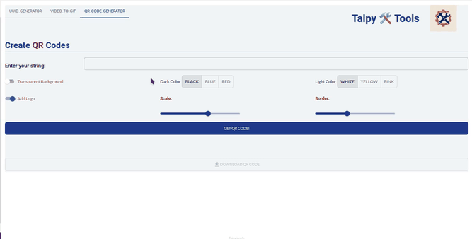

# Taipy 🛠️ Tools

- [Taipy 🛠️ Tools](#taipy-️-tools)
  - [Why Taipy 🛠️ Tools?](#why-taipy-️-tools)
  - [Available Applications](#available-applications)
    - [UUID Generator](#uuid-generator)
    - [Video to GIF](#video-to-gif)
    - [QR Code Generator](#qr-code-generator)

This repo is a multiple-tab app, created with Taipy.

The goal is to show how you can use Taipy in enterprise environments to create small dedicated, single-purpose applications for company.

This is how the tabs look for the three main mini-apps: A UUID generator, a Video to GIF converter, and a QR Code generator:

## Why Taipy 🛠️ Tools?

Creating small enterprise apps has several advantages:

* It allows **customization**, such as including company logos, corporate colors or any other distinctive corporate style (image, for your company's QR Codes)
* It keeps data inside the company. Sure, there are plenty of GIF generators online, but do you want your employees uploading internal screenshots to random sites?
* Your company may have some small but specific tasks that users could perform with a small Python function: You can bring it to users with Taipy.
* You can integrate your mini-apps with in-house tools or databases. (I'll be showing more apps built in that style in other projects).

Now, Taipy is mainly a data application builder. Examples of typical data apps include:

* Dashboards
* Optimization apps
* Forcasting (Machine Leanrning) apps
* AI apps...

**The apps I listed here aren't data apps**. So why use Taipy for this type of thing?

* Big companies often restrict the number of tools employees can use. Taipy’s main use case isn’t building these utility-style apps... but the fact that you can do it, and deploy them easily in production, is a real plus.
* Taipy is designed to speed up (and even make possible) the creation of data apps by professionals who use Python. But Python’s not just for "data people" anymore. I made these apps quickly, and they could go into production with minimal effort. In corporate environments where dev processes often turn into a bottlenecked, endless black hole: this is a real, practical use case.
Using a simple app generator like Taipy can streamline those processes significantly.
* And well, I had lots of fun doing this 😃!

## Available Applications

These are the tools included in Taipy 🛠️ Tools, I may add more as it goes (feel free to open an issue if you think of a useful mini app!):

### UUID Generator

Uses the [uuid-utils](https://github.com/aminalaee/uuid-utils), which is faster than the `uuid` native Python library. The reason is because i**t provides a unified API for all UUID types**. The app omits UUID type 8 (and type 2, but one isn't in use, and the APIs don't provide it either).

This library is also about 10 times faster than the native `uuid` library, but for an app like this one, where it generates one UUID at a time, the performance gain is unsignificant (I still encourage you to take a look at the prock if you use UUIDs).

### Video to GIF

This generates GIF images from Videos. It uses [MoviePy](https://zulko.github.io/moviepy/).
It's not really optimized (GIF outputs are really big).

I may have to make some changes, but MoviePy's API changed recently and the documentation doesn't seem all the way up to date. This is a library I'm currently tring to learn, and most of the code in this app comes from a chatbot. 

### QR Code Generator

The QR code generator uses [Segno](https://segno.readthedocs.io/en/latest/), **a library I love!**

There you have it:

